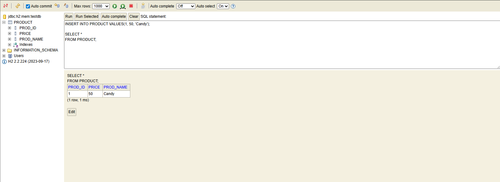
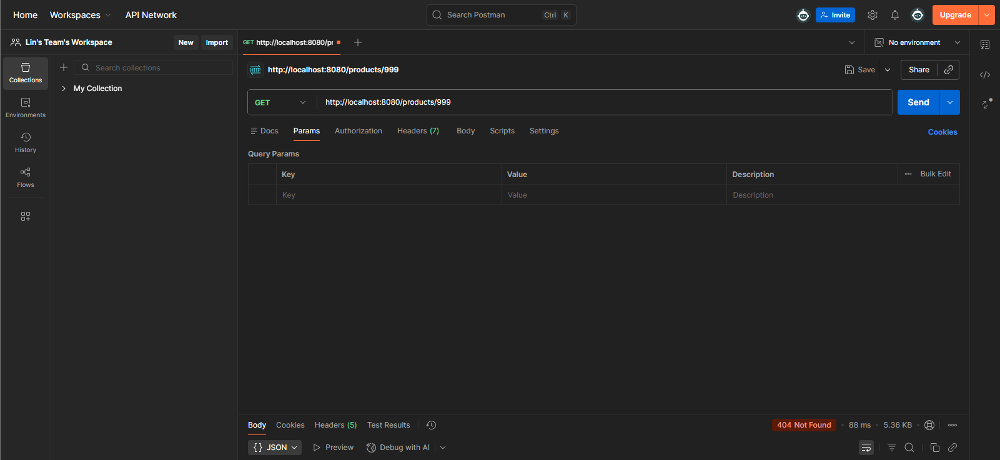

<h1 align="center">Simple Web App - Product Management System</h1>

  A RESTful API project built with <b>Spring Boot</b>, implementing full CRUD (Create, Read, Update, Delete) functionality for product management, with data persistence integrated via H2 database.

<h2>Tech Stack</h2>
<ul>
  <li><b>Java 21</b></li>
  <li><b>Spring Boot 3</b></li>
  <li><b>Spring Data JPA</b> (Database abstraction)</li>
  <li><b>H2 Database</b> (In-memory development database)</li>
  <li><b>Lombok</b> (To reduce boilerplate code)</li>
  <li><b>Maven</b> (Project management and build tool)</li>
</ul>

<h2>API Endpoints</h2>
<table width="100%">
  <thead>
    <tr>
      <th align="left">HTTP Method</th>
      <th align="left">Path</th>
      <th align="left">Description</th>
      <th align="left">Expected Status</th>
    </tr>
  </thead>
  <tbody>
    <tr>
      <td><code>GET</code></td>
      <td><code>/products</code></td>
      <td>Retrieve all products</td>
      <td>200 OK</td>
    </tr>
    <tr>
      <td><code>GET</code></td>
      <td><code>/products/{id}</code></td>
      <td>Retrieve a specific product by ID</td>
      <td>200 OK / 404</td>
    </tr>
    <tr>
      <td><b><code>POST</code></b></td>
      <td><code>/products</code></td>
      <td>Add a new product</td>
      <td>201 Created</td>
    </tr>
    <tr>
      <td><code>PUT</code></td>
      <td><code>/products</code></td>
      <td>Update an existing product</td>
      <td>200 OK</td>
    </tr>
    <tr>
      <td><code>DELETE</code></td>
      <td><code>/products/{id}</code></td>
      <td>Delete a specific product</td>
      <td>200 OK</td>
    </tr>
  </tbody>
</table>

<h2>Demo Screenshots</h2>
<table border="0" width="100%">
  <tr>
    <td align="center" width="50%">
      
<b>H2 Database Record</b>

       
      <em>(Successfully inserted data into H2 database)</em>
    </td>
    <td align="center" width="50%">
      
<b>Exception Handling (404)</b>

       
      <em>(Exception handling verified: returns 404 Not Found)</em>
    </td>
  </tr>
</table>

<h2>How to Run</h2>

<h3>1. Clone the repository</h3>
<pre><code>git clone &lt;YOUR_GITHUB_REPO_URL&gt;</code></pre>

<h3>2. Run the application</h3>

Navigate to the project directory and execute:

<pre><code>mvn spring-boot:run</code></pre>

<h3>3. Access H2 Console</h3>
<ul>
  <li><b>URL:</b> <code>http://localhost:8080/h2-console</code></li>
  <li><b>JDBC URL:</b> <code>jdbc:h2:mem:testdb</code></li>
  <li><b>User:</b> <code>sa</code> / <b>Password:</b> <code>12345</code></li>
</ul>

<h2>Future Enhancements</h2>
<ul>
  <li>Implement Spring Security for API authentication.</li>
  <li>Integrate Swagger (SpringDoc) for interactive API documentation.</li>
  <li>Add comprehensive Unit Tests using JUnit 5 and Mockito.</li>
</ul>
